# Architecture Overview

GitSync is designed with a modular architecture that provides flexibility, reliability, and extensibility. This document provides a comprehensive overview of the system architecture.

## System Architecture


## Core Design Principles

### 1. Modularity

Each component has a single, well-defined responsibility:

- **Sync Engines**: Handle the actual synchronization logic
- **Support Modules**: Provide cross-cutting concerns (auth, proxy, SSL)
- **Cache Manager**: Manages metadata and incremental updates
- **CLI**: Provides user interface and orchestration

### 2. Flexibility

GitSync adapts to various environments:

- **Dual sync methods**: API and browser automation
- **Auto-detection**: Proxy and certificate discovery
- **Configuration layers**: Files, environment variables, command-line

### 3. Reliability

Built-in resilience and error handling:

- **Automatic retries**: For transient network failures
- **Fallback mechanisms**: Browser method when API fails
- **Incremental updates**: Resume interrupted syncs
- **Data integrity**: SHA verification for all files

### 4. Performance

Optimized for efficiency:

- **Parallel downloads**: Multiple concurrent file transfers
- **Incremental syncing**: Only transfer changed files
- **Intelligent caching**: Minimize API calls
- **Chunk-based transfers**: For large files

## Component Architecture

### GitHubAPISync Facade

The main facade that coordinates specialized components:

```python
class GitHubAPISync:
    """Facade coordinating specialized sync components."""
    
    def __init__(self, repo_url: str, local_path: str, token: Optional[str] = None):
        self.api_client = GitHubAPIClient(session_factory, repo_url)
        self.repo_manager = RepositoryManager(self.api_client, repo_url)
        self.file_sync = FileSynchronizer(self.api_client, local_path)
        self.progress = ProgressTracker()
    
    def sync(self, ref: str = "main") -> bool:
        """Coordinate components for complete sync."""
        # 1. Test connection
        # 2. Resolve reference
        # 3. Get repository tree
        # 4. Synchronize files
        # 5. Report progress
        # 6. Return success status
```

**Responsibilities:**
- Provide simple public interface
- Coordinate component interactions
- Maintain backward compatibility
- Orchestrate sync workflow

### Component Architecture

#### API Client

Handles low-level GitHub API operations:

```python
class GitHubAPIClient:
    """Low-level GitHub API client."""
    
    def __init__(self, session_factory, base_url):
        self.session = session_factory.create_session()
        self.base_url = base_url
    
    def make_request(self, endpoint, **kwargs):
        """Generic API request handling."""
        # Handle authentication
        # Manage rate limits
        # Retry on failure
```

#### Repository Manager

Manages repository metadata and structure:

```python
class RepositoryManager:
    """Repository-specific operations."""
    
    def resolve_ref(self, ref: str) -> str:
        """Resolve branch/tag/commit to SHA."""
        
    def get_tree(self, ref: str) -> List[FileInfo]:
        """Get repository file tree."""
```

#### File Synchronizer

Handles file synchronization logic:

```python
class FileSynchronizer:
    """File sync and incremental updates."""
    
    def sync_files(self, files: List[FileInfo]):
        """Synchronize files to local directory."""
        # Compare with cache
        # Download changed files
        # Update local files
        # Save metadata
```

### Browser Sync Engine

Implements browser automation using Playwright:

```python
class GitHubBrowserSync:
    """Playwright-based synchronization engine."""
    
    def sync(self) -> bool:
        """Perform browser-based sync."""
        # 1. Launch browser with Playwright
        # 2. Navigate to repository
        # 3. Download ZIP archive
        # 4. Extract and compare
        # 5. Update changed files
```

**Key Features:**
- Playwright automation framework
- Multi-browser support (Chromium, Firefox, WebKit)
- Headless mode operation
- Automatic wait strategies
- Network interception capabilities

### Session Factory

Creates configured HTTP sessions:

```python
class SessionFactory:
    """Factory for creating configured HTTP sessions."""
    
    def create_session(self, config: Config) -> requests.Session:
        """Create session with proxy, SSL, and auth."""
        session = requests.Session()
        self.configure_ssl(session, config)
        self.configure_proxy(session, config)
        self.configure_auth(session, config)
        return session
```

### Abstract Interfaces

Define contracts for pluggable implementations:

```python
class SyncProvider(ABC):
    """Interface for sync implementations."""
    def sync(self, ref: str) -> bool: ...
    def test_connection(self) -> bool: ...
    def get_status(self) -> Dict: ...

class ProxyProvider(ABC):
    """Interface for proxy configuration."""
    def get_proxy_config(self, url: str) -> Dict: ...
    def detect_proxy(self) -> bool: ...

class CertificateProvider(ABC):
    """Interface for certificate handling."""
    def get_certificates(self) -> List: ...
    def export_certificates(self) -> str: ...
```

**Cache Structure:**
```json
{
  "version": "1.0",
  "repository": {
    "url": "https://github.com/user/repo",
    "ref": "main",
    "last_commit": "abc123"
  },
  "files": {
    "README.md": {
      "sha": "def456",
      "size": 1234,
      "modified": "2025-01-15T10:30:00Z"
    }
  },
  "sync": {
    "last_sync": "2025-01-15T10:30:00Z",
    "method": "api"
  }
}
```

## Data Flow

### API Sync Flow


### Browser Sync Flow

```mermaid
sequenceDiagram
    participant User
    participant CLI
    participant BrowserSync
    participant Browser
    participant GitHub
    participant FileSystem
    
    User->>CLI: gitsync sync --method browser
    CLI->>BrowserSync: Initialize sync
    BrowserSync->>Browser: Launch Chrome
    Browser->>GitHub: Navigate to repository
    BrowserSync->>Browser: Click "Code" → "Download ZIP"
    Browser->>GitHub: Download repository ZIP
    GitHub-->>Browser: ZIP file
    BrowserSync->>BrowserSync: Extract file list from ZIP
    BrowserSync->>FileSystem: Compare with local files
    BrowserSync->>Browser: Download changed files
    Browser->>GitHub: GET individual files
    GitHub-->>Browser: File contents
    BrowserSync->>FileSystem: Write files
    BrowserSync-->>CLI: Sync complete
    CLI-->>User: Success message
```



## Configuration Architecture

### Configuration Layers

Configuration is resolved in priority order:

1. **Command-line arguments** (highest priority)
2. **Environment variables**
3. **Configuration file**
4. **Default values** (lowest priority)

```python
class ConfigResolver:
    """Resolves configuration from multiple sources."""
    
    def resolve(self) -> Config:
        config = self.load_defaults()
        config.merge(self.load_file())
        config.merge(self.load_environment())
        config.merge(self.load_cli_args())
        return config
```

### Configuration Schema

```yaml
# Complete configuration schema
repository:
  url: str              # Required: GitHub repository URL
  ref: str              # Branch, tag, or commit (default: main)

local:
  path: str             # Required: Local directory path

auth:
  token: str            # GitHub personal access token
  username: str         # For basic auth (browser method)
  password: str         # For basic auth (browser method)

sync:
  method: enum          # api, browser, or auto
  incremental: bool     # Enable incremental updates
  force: bool           # Force full sync
  parallel_downloads: int
  chunk_size: int
  retry_count: int
  retry_delay: float
  ignore_patterns: list
  skip_large_files: bool
  large_file_size: int

network:
  proxy:
    http: str
    https: str
    no_proxy: list
    auth:
      username: str
      password: str
  ssl:
    verify: bool
    ca_bundle: str
    cert_file: str
    key_file: str
  pac:
    url: str
    file: str
    cache: bool

browser:
  type: enum            # chrome, chromium, edge
  path: str             # Browser executable path
  driver_path: str      # ChromeDriver path
  headless: bool
  window_size: str
  timeout: int
  download_timeout: int
  user_agent: str
  cookie_file: str
  reuse_session: bool

logging:
  level: enum           # DEBUG, INFO, WARNING, ERROR
  file: str             # Log file path
  format: str           # Log format string
  console: bool         # Enable console output
```

## Security Architecture

### Authentication


### Certificate Handling


## Error Handling Strategy

### Error Hierarchy

```python
# Base exceptions
class GitSyncError(Exception):
    """Base exception for all GitSync errors."""

class ConfigurationError(GitSyncError):
    """Configuration-related errors."""

# Network exceptions
class NetworkError(GitSyncError):
    """Network and connectivity errors."""

class RateLimitError(NetworkError):
    """API rate limit exceeded."""

class ProxyError(NetworkError):
    """Proxy configuration errors."""

class SSLError(NetworkError):
    """SSL/TLS certificate errors."""

# Authentication exceptions
class AuthenticationError(GitSyncError):
    """Authentication and authorization errors."""

class TokenError(AuthenticationError):
    """Invalid or expired token."""

# Repository exceptions
class RepositoryError(GitSyncError):
    """Repository access errors."""

class InvalidRefError(RepositoryError):
    """Invalid branch, tag, or commit."""

# File system exceptions
class FileSystemError(GitSyncError):
    """Local file system errors."""

class PermissionError(FileSystemError):
    """File permission errors."""

# Browser exceptions
class BrowserError(GitSyncError):
    """Browser automation errors."""

class BrowserNotFoundError(BrowserError):
    """Browser executable not found."""
```

### Retry Logic

```python
class RetryHandler:
    """Handles retry logic for transient failures."""
    
    def __init__(self, max_retries=3, backoff_factor=2):
        self.max_retries = max_retries
        self.backoff_factor = backoff_factor
    
    def execute_with_retry(self, func, *args, **kwargs):
        """Execute function with exponential backoff retry."""
        for attempt in range(self.max_retries):
            try:
                return func(*args, **kwargs)
            except TransientError as e:
                if attempt == self.max_retries - 1:
                    raise
                delay = self.backoff_factor ** attempt
                time.sleep(delay)
```

## Performance Optimizations

### Parallel Downloads

```python
class ParallelDownloader:
    """Downloads multiple files concurrently."""
    
    def download_files(self, files: List[FileInfo], max_workers=5):
        """Download files in parallel."""
        with ThreadPoolExecutor(max_workers=max_workers) as executor:
            futures = {
                executor.submit(self.download_file, file): file
                for file in files
            }
            
            for future in as_completed(futures):
                file = futures[future]
                try:
                    result = future.result()
                    yield file, result
                except Exception as e:
                    self.handle_error(file, e)
```

### Incremental Updates

```python
class IncrementalSync:
    """Manages incremental synchronization."""
    
    def get_changes(self, remote_tree, local_cache):
        """Identify changed files."""
        changes = {
            'new': [],
            'modified': [],
            'deleted': [],
            'unchanged': []
        }
        
        for remote_file in remote_tree:
            local_file = local_cache.get(remote_file.path)
            
            if not local_file:
                changes['new'].append(remote_file)
            elif local_file.sha != remote_file.sha:
                changes['modified'].append(remote_file)
            else:
                changes['unchanged'].append(remote_file)
        
        # Check for deleted files
        for local_path in local_cache:
            if local_path not in remote_tree:
                changes['deleted'].append(local_path)
        
        return changes
```

## Extension Points

### Custom Sync Engines

```python
class CustomSyncEngine(BaseSyncEngine):
    """Template for custom sync engines."""
    
    def sync(self) -> SyncResult:
        """Implement custom sync logic."""
        raise NotImplementedError
    
    def validate_config(self) -> bool:
        """Validate engine-specific configuration."""
        raise NotImplementedError
```

### Plugin Architecture

```python
class PluginManager:
    """Manages GitSync plugins."""
    
    def load_plugins(self, plugin_dir: str):
        """Load plugins from directory."""
        for plugin_file in Path(plugin_dir).glob("*.py"):
            spec = importlib.util.spec_from_file_location(
                plugin_file.stem, plugin_file
            )
            module = importlib.util.module_from_spec(spec)
            spec.loader.exec_module(module)
            
            # Register plugin
            if hasattr(module, 'register'):
                module.register(self)
```

## Monitoring and Telemetry

### Metrics Collection

```python
class MetricsCollector:
    """Collects performance metrics."""
    
    def __init__(self):
        self.metrics = {
            'sync_duration': [],
            'files_processed': 0,
            'bytes_transferred': 0,
            'api_calls': 0,
            'errors': []
        }
    
    def record_sync(self, duration, files, bytes_transferred):
        """Record sync metrics."""
        self.metrics['sync_duration'].append(duration)
        self.metrics['files_processed'] += files
        self.metrics['bytes_transferred'] += bytes_transferred
```

### Logging Architecture

```python
class LogManager:
    """Manages logging configuration."""
    
    def setup_logging(self, config):
        """Configure logging based on config."""
        handlers = []
        
        # Console handler
        if config.logging.console:
            handlers.append(logging.StreamHandler())
        
        # File handler
        if config.logging.file:
            handlers.append(logging.FileHandler(config.logging.file))
        
        logging.basicConfig(
            level=config.logging.level,
            format=config.logging.format,
            handlers=handlers
        )
```

## Future Architecture Considerations

### Planned Enhancements

1. **Plugin System**: Extensible architecture for custom sync methods
2. **Distributed Caching**: Share cache across multiple machines
3. **Webhook Integration**: Real-time sync triggers
4. **Multi-repository Support**: Sync multiple repos simultaneously
5. **Partial Sync**: Sync specific directories or file patterns
6. **Compression**: Compress transfers for bandwidth optimization

### Scalability Considerations

- **Connection Pooling**: Reuse HTTP connections
- **Async Operations**: Async/await for I/O operations
- **Memory Management**: Stream large files instead of loading
- **Rate Limiting**: Respect and adapt to rate limits
- **Caching Strategy**: LRU cache for frequently accessed data

## Conclusion

GitSync's architecture is designed to be:

- **Flexible**: Adapts to various network environments
- **Reliable**: Handles failures gracefully
- **Efficient**: Optimizes for performance
- **Extensible**: Supports future enhancements
- **Maintainable**: Clean separation of concerns

The modular design allows for easy testing, debugging, and enhancement of individual components without affecting the entire system.