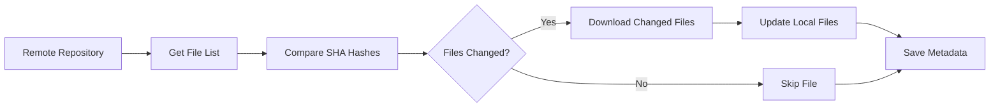

# Incremental Sync Guide

Incremental synchronization is one of GitBridge's most powerful features, allowing you to sync only changed files after the initial download. This significantly reduces bandwidth usage and sync time.

## How Incremental Sync Works

### Overview

Instead of downloading all files every time, GitBridge:

1. **Tracks file metadata** - Stores SHA hashes and timestamps
2. **Compares with remote** - Checks which files changed
3. **Downloads only changes** - Transfers only modified files
4. **Updates metadata** - Saves new state for next sync



## Metadata Storage

GitBridge stores metadata in a hidden `.gitbridge` directory:

```
your-repo/
├── .gitbridge/
│   ├── metadata.json      # File hashes and timestamps
│   ├── config.json        # Sync configuration
│   └── cache/            # Temporary files
├── src/
├── docs/
└── README.md
```

### Metadata Structure

```json
{
  "version": "1.0",
  "repository": {
    "url": "https://github.com/user/repo",
    "ref": "main",
    "last_commit": "abc123def456"
  },
  "files": {
    "README.md": {
      "sha": "d3b07384d113edec49eaa6238ad5ff00",
      "size": 1234,
      "mode": "100644",
      "modified": "2025-01-20T10:30:00Z"
    },
    "src/main.py": {
      "sha": "c157a79031e1c40f85931829bc5fc552",
      "size": 5678,
      "mode": "100755",
      "modified": "2025-01-20T10:31:00Z"
    }
  },
  "sync": {
    "last_sync": "2025-01-20T10:35:00Z",
    "method": "api",
    "duration": 12.5,
    "files_synced": 2,
    "bytes_transferred": 6912
  }
}
```

## Enabling Incremental Sync

### Configuration File

```yaml
sync:
  incremental: true  # Enable incremental sync
  force: false       # Set to true to force full sync
```

### Command Line

```bash
# Enable incremental sync (default)
gitbridge sync --config config.yaml --incremental

# Force full sync (ignore cache)
gitbridge sync --config config.yaml --force
```

### Python API

```python
from gitbridge.api_sync import GitHubAPISync

sync = GitHubAPISync(
    repo_url="https://github.com/user/repo",
    local_path="/path/to/local",
    incremental=True  # Enable incremental sync
)

# Incremental sync
sync.sync()

# Force full sync
sync.sync(force=True)
```

## Performance Benefits

### Bandwidth Savings

Example for a 1GB repository with daily changes:

| Sync Type | Initial Sync | Daily Updates | Monthly Total |
|-----------|-------------|---------------|---------------|
| Full Sync | 1 GB | 1 GB/day | 30 GB |
| Incremental | 1 GB | ~10 MB/day | 1.3 GB |
| **Savings** | - | 99% | 96% |

### Time Savings

Typical sync times for a medium-sized repository:

| Operation | Full Sync | Incremental Sync |
|-----------|-----------|------------------|
| Check changes | - | 2-3 seconds |
| Download files | 2-5 minutes | 5-10 seconds |
| Update metadata | 1 second | 1 second |
| **Total** | 2-5 minutes | 10-15 seconds |

## Change Detection

### SHA-Based Comparison

GitBridge uses SHA hashes to detect changes:

```python
def file_changed(local_file, remote_file):
    """Check if file has changed."""
    if not local_file.exists():
        return True  # New file
    
    local_sha = calculate_sha(local_file)
    return local_sha != remote_file.sha
```

### Supported Change Types

GitBridge detects and handles:

- **New files** - Added to repository
- **Modified files** - Content changed
- **Deleted files** - Removed from repository
- **Renamed files** - Detected via SHA matching
- **Permission changes** - File mode updates

## Cache Management

### Cache Location

Default cache locations:

- **Linux/macOS**: `~/.gitbridge/cache/`
- **Windows**: `%APPDATA%\gitbridge\cache\`
- **Custom**: Set via configuration

```yaml
cache:
  enabled: true
  path: ~/.gitbridge/cache
  ttl: 3600  # Cache TTL in seconds
  max_size: 1073741824  # 1GB maximum cache size
```

### Cache Operations

```bash
# Clear cache for specific repository
gitbridge cache clear --repo https://github.com/user/repo

# Clear all cache
gitbridge cache clear --all

# Show cache statistics
gitbridge cache stats
```

### Cache Statistics Example

```
Cache Statistics
================

Location: ~/.gitbridge/cache
Total size: 156.7 MB
Repositories: 5
Oldest entry: 2025-01-15 10:30:00
Newest entry: 2025-01-20 14:45:00

Repository Cache:
  https://github.com/user/repo1: 45.2 MB (1,234 files)
  https://github.com/user/repo2: 23.1 MB (567 files)
  https://github.com/user/repo3: 88.4 MB (2,345 files)

Cache hit rate: 92.3%
Bandwidth saved: 2.4 GB
```

## Optimizing Incremental Sync

### 1. Exclude Unnecessary Files

Reduce sync overhead by excluding files:

```yaml
sync:
  ignore_patterns:
    - "*.log"          # Log files
    - "*.tmp"          # Temporary files
    - ".DS_Store"      # macOS files
    - "node_modules/"  # Dependencies
    - "build/"         # Build artifacts
    - "*.pyc"          # Python bytecode
```

### 2. Optimize Check Frequency

Balance freshness with performance:

```yaml
sync:
  check_interval: 300  # Check for changes every 5 minutes
  min_interval: 60     # Minimum 1 minute between syncs
```

### 3. Use Parallel Downloads

Speed up multi-file updates:

```yaml
sync:
  parallel_downloads: 10  # Download up to 10 files simultaneously
  chunk_size: 1048576    # 1MB chunks for large files
```

### 4. Smart Scheduling

Schedule syncs based on activity:

```bash
# Frequent syncs during work hours
0 9-17 * * 1-5 gitbridge sync --config work.yaml

# Less frequent on weekends
0 */4 * * 0,6 gitbridge sync --config work.yaml
```

## Handling Edge Cases

### Corrupted Cache

If cache becomes corrupted:

```bash
# Force rebuild cache
gitbridge sync --config config.yaml --force --rebuild-cache

# Or manually delete cache
rm -rf .gitbridge/metadata.json
gitbridge sync --config config.yaml
```

### Partial Syncs

Resume interrupted syncs:

```yaml
sync:
  resume_on_error: true
  checkpoint_interval: 100  # Save progress every 100 files
```

### Large File Handling

Optimize for repositories with large files:

```yaml
sync:
  large_file_threshold: 104857600  # 100MB
  large_file_strategy: stream      # Stream instead of loading to memory
  skip_large_files: false          # Set true to skip large files
```

## Monitoring Sync Performance

### Enable Metrics

```yaml
monitoring:
  enabled: true
  metrics_file: ~/.gitbridge/metrics.json
  include_timing: true
  include_bandwidth: true
```

### View Sync Statistics

```bash
# Show last sync statistics
gitbridge stats --last

# Show historical statistics
gitbridge stats --history --days 30

# Export statistics
gitbridge stats --export csv --output sync-stats.csv
```

### Sample Statistics Output

```
Sync Statistics (Last 30 days)
===============================

Total syncs: 145
Successful: 142 (97.9%)
Failed: 3 (2.1%)

Performance:
  Average sync time: 8.3 seconds
  Fastest sync: 2.1 seconds
  Slowest sync: 45.2 seconds

Data Transfer:
  Total downloaded: 234.5 MB
  Total files: 3,456
  Average file size: 69.8 KB
  Bandwidth saved: 4.2 GB (94.7%)

Incremental Efficiency:
  Cache hit rate: 93.2%
  Files skipped: 45,678 (92.9%)
  Files updated: 3,456 (7.1%)
```

## Troubleshooting Incremental Sync

### Common Issues

#### Files Re-downloading Every Time

**Problem**: Incremental sync not working

**Solutions**:
```bash
# Check if incremental is enabled
gitbridge status --show-config | grep incremental

# Check cache permissions
ls -la .gitbridge/

# Fix permissions
chmod 755 .gitbridge
chmod 644 .gitbridge/metadata.json
```

#### Slow Change Detection

**Problem**: Checking for changes takes too long

**Solutions**:
```yaml
# Optimize configuration
sync:
  parallel_checks: true    # Check files in parallel
  batch_size: 100         # Process files in batches
  shallow_check: true     # Quick check mode
```

#### Cache Growing Too Large

**Problem**: Cache directory consuming too much space

**Solutions**:
```yaml
cache:
  max_size: 536870912     # 512MB limit
  auto_cleanup: true      # Automatic cleanup
  cleanup_age: 7          # Remove entries older than 7 days
```

### Debug Incremental Sync

Enable detailed logging:

```bash
# Debug incremental sync process
GITSYNC_DEBUG=incremental gitbridge sync --config config.yaml -v

# Log cache operations
gitbridge sync --config config.yaml --log-level DEBUG --log-file sync.log
```

## Best Practices

### 1. Regular Syncs

Keep metadata fresh with regular syncs:

```bash
# Cron job for hourly syncs
0 * * * * gitbridge sync --config config.yaml --quiet
```

### 2. Monitor Cache Health

```bash
# Weekly cache maintenance
0 0 * * 0 gitbridge cache maintain --config config.yaml
```

### 3. Backup Metadata

Preserve sync state:

```bash
# Backup metadata before major changes
cp .gitbridge/metadata.json .gitbridge/metadata.backup.json
```

### 4. Version Control Exclusion

Add to `.gitignore`:

```gitignore
# GitBridge metadata
.gitbridge/
```

## API Integration

### Custom Change Detection

```python
from gitbridge.api_sync import GitHubAPISync

class CustomSync(GitHubAPISync):
    def file_changed(self, local_file, remote_file):
        """Custom change detection logic."""
        # Add custom logic here
        if self.is_binary_file(local_file):
            return self.binary_changed(local_file, remote_file)
        else:
            return super().file_changed(local_file, remote_file)
```

### Progress Callbacks

```python
def on_progress(current, total, filename):
    """Progress callback."""
    percent = (current / total) * 100
    print(f"Progress: {percent:.1f}% - {filename}")

sync = GitHubAPISync(
    repo_url="https://github.com/user/repo",
    local_path="/path/to/local",
    progress_callback=on_progress
)
```

## Next Steps

- [Configure sync methods](sync-methods.md)
- [Optimize for corporate environment](corporate-setup.md)
- [Set up automated syncing](../cli/index.md#cron-jobs)
- [Monitor sync performance](../troubleshooting/index.md)