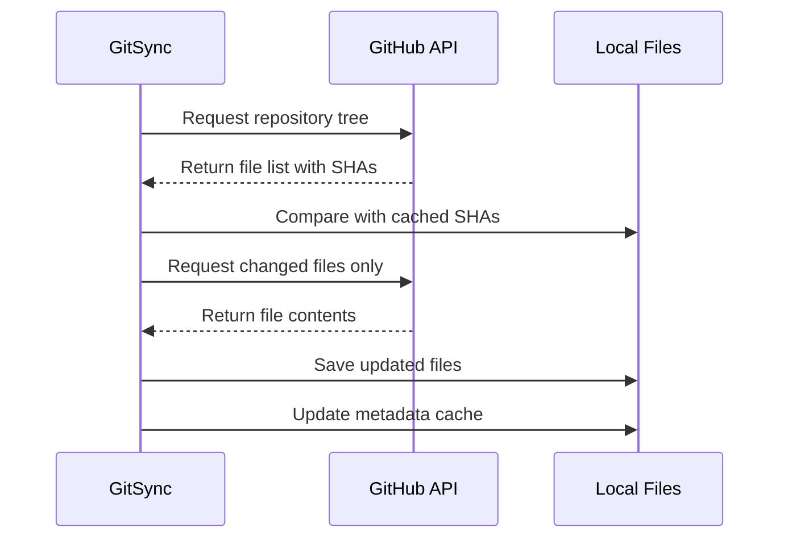
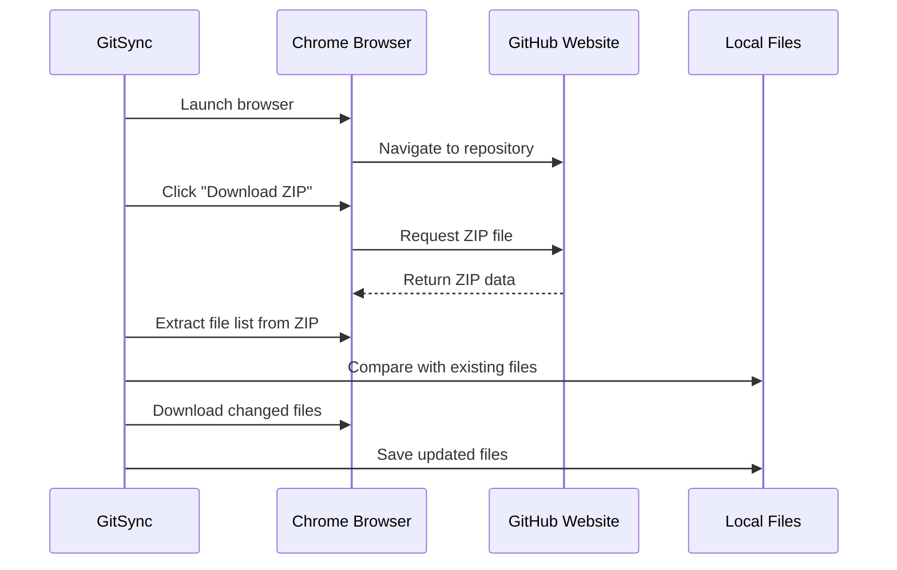

# Synchronization Methods

GitSync provides two methods for synchronizing GitHub repositories, ensuring you can always access your code regardless of network restrictions.

## Overview

| Method | Speed | Requirements | Use Case |
|--------|-------|--------------|----------|
| **API** | Fast ⚡ | GitHub token (for private repos) | Default method, most efficient |
| **Browser** | Slow 🐢 | Chrome/Chromium browser | When API access is blocked |

## API Synchronization Method

The API method uses GitHub's REST API to efficiently sync repositories.

### How It Works



### Features

- **Incremental Updates**: Only downloads changed files
- **Parallel Downloads**: Multiple files downloaded simultaneously  
- **SHA Verification**: Ensures file integrity
- **Efficient for Large Repos**: Minimal bandwidth usage
- **Branch/Tag Support**: Sync any ref (branch, tag, commit)

### Configuration

=== "Command Line"

    ```bash
    gitsync sync \
      --repo https://github.com/user/repo \
      --local ~/projects/repo \
      --method api \
      --token YOUR_TOKEN
    ```

=== "Configuration File"

    ```yaml
    sync:
      method: api
      incremental: true
      parallel_downloads: 5
      chunk_size: 1048576  # 1MB chunks
    
    auth:
      token: ${GITHUB_TOKEN}
    ```

### API Rate Limits

GitHub API has rate limits:

- **Unauthenticated**: 60 requests/hour
- **Authenticated**: 5,000 requests/hour
- **GitHub Enterprise**: Varies by installation

!!! tip "Avoiding Rate Limits"
    - Always use authentication token
    - Enable incremental mode
    - Cache metadata between syncs
    - Use `--verbose` to monitor API usage

### Advanced Options

```yaml
sync:
  method: api
  
  # Performance tuning
  parallel_downloads: 10      # Number of concurrent downloads
  chunk_size: 2097152         # 2MB chunks for large files
  retry_count: 3              # Retry failed downloads
  retry_delay: 5              # Seconds between retries
  
  # Filtering
  ignore_patterns:            # Files to skip
    - "*.log"
    - ".DS_Store"
    - "node_modules/"
  
  # Large files
  skip_large_files: true      # Skip files > 100MB
  large_file_size: 104857600  # 100MB threshold
```

## Browser Automation Method

The browser method uses Selenium WebDriver to automate a real browser, mimicking manual repository browsing.

### How It Works



### Features

- **Works Anywhere**: If you can browse GitHub, it works
- **No API Token Required**: Uses browser session
- **Handles JavaScript**: Works with dynamic content
- **Cookie Support**: Can use existing browser sessions
- **Proxy Aware**: Uses browser's proxy settings

### Configuration

=== "Command Line"

    ```bash
    gitsync sync \
      --repo https://github.com/user/repo \
      --local ~/projects/repo \
      --method browser \
      --browser-path /usr/bin/chromium
    ```

=== "Configuration File"

    ```yaml
    sync:
      method: browser
      browser:
        type: chrome              # chrome, chromium, or edge
        path: /usr/bin/chromium  # Optional: custom browser path
        headless: true           # Run without GUI
        timeout: 30              # Page load timeout
        download_timeout: 300    # File download timeout
    ```

### Browser Setup

#### Chrome/Chromium Installation

=== "Windows"

    ```powershell
    # Using winget
    winget install Google.Chrome
    
    # Or download from
    # https://www.google.com/chrome/
    ```

=== "macOS"

    ```bash
    # Using Homebrew
    brew install --cask google-chrome
    # or
    brew install chromium
    ```

=== "Linux"

    ```bash
    # Ubuntu/Debian
    sudo apt-get install chromium-browser
    
    # Fedora
    sudo dnf install chromium
    
    # Arch
    sudo pacman -S chromium
    ```

#### ChromeDriver

ChromeDriver is automatically managed by Selenium 4+, but you can specify a custom path:

```yaml
sync:
  browser:
    driver_path: /usr/local/bin/chromedriver
```

### Advanced Options

```yaml
sync:
  method: browser
  browser:
    type: chrome
    headless: true            # Run without GUI (faster)
    window_size: "1920,1080"  # Browser window size
    
    # Performance
    page_load_strategy: eager  # Don't wait for all resources
    disable_images: true       # Don't load images (faster)
    disable_javascript: false  # Keep JS enabled for GitHub
    
    # Timeouts
    implicit_wait: 10         # Wait for elements (seconds)
    page_timeout: 30          # Page load timeout
    script_timeout: 30        # JavaScript execution timeout
    download_timeout: 300     # File download timeout
    
    # Browser options
    user_agent: "GitSync/1.0"
    accept_language: "en-US"
    
    # Proxy (if not using system proxy)
    proxy:
      http: "http://proxy:8080"
      https: "http://proxy:8080"
      no_proxy: "localhost,127.0.0.1"
```

### Handling Authentication

For private repositories with browser method:

1. **Manual Login** (Recommended for first use):
   ```bash
   # Run in non-headless mode
   gitsync sync --method browser --no-headless
   # Log in manually when browser opens
   # Cookies will be saved for future use
   ```

2. **Cookie Reuse**:
   ```yaml
   sync:
     browser:
       cookie_file: ~/.gitsync/cookies.json
       reuse_session: true
   ```

3. **Basic Auth** (if supported):
   ```yaml
   auth:
     username: your_username
     password: your_password  # Or use token as password
   ```

## Choosing the Right Method

### Use API Method When:

- ✅ You have network access to api.github.com
- ✅ You need fast synchronization
- ✅ You're syncing large repositories
- ✅ You need incremental updates
- ✅ You're automating syncs

### Use Browser Method When:

- ✅ API access is blocked by firewall
- ✅ Only browser access to GitHub works
- ✅ You need to handle complex authentication
- ✅ You're syncing occasionally (not time-critical)
- ✅ API rate limits are exhausted

## Method Comparison

### Performance Comparison

| Aspect | API Method | Browser Method |
|--------|------------|----------------|
| Initial sync (1GB repo) | ~2 minutes | ~15 minutes |
| Incremental update | ~5 seconds | ~2 minutes |
| Memory usage | Low (50MB) | High (500MB+) |
| CPU usage | Low | Medium-High |
| Network efficiency | Excellent | Good |

### Feature Comparison

| Feature | API Method | Browser Method |
|---------|------------|----------------|
| Incremental updates | ✅ Yes | ✅ Yes |
| Parallel downloads | ✅ Yes | ❌ No |
| Large file support | ⚠️ Limited | ✅ Yes |
| Authentication | Token | Browser session |
| Proxy support | ✅ Yes | ✅ Yes |
| Rate limiting | Yes (5k/hour) | No |
| JavaScript required | ❌ No | ✅ Yes |

## Fallback Strategy

Configure automatic fallback from API to browser method:

```yaml
sync:
  method: auto  # Try API first, fallback to browser
  fallback_on_error: true
  
  # Primary method (API)
  api:
    retry_count: 2
    timeout: 30
  
  # Fallback method (Browser)  
  browser:
    headless: true
    timeout: 60
```

Implementation in code:

```python
from gitsync import GitHubAPISync, GitHubBrowserSync

def sync_with_fallback(repo_url, local_path, token=None):
    """Sync with automatic fallback to browser method."""
    
    # Try API method first
    try:
        api_sync = GitHubAPISync(repo_url, local_path, token)
        return api_sync.sync()
    except Exception as e:
        print(f"API sync failed: {e}")
        print("Falling back to browser method...")
        
        # Fallback to browser method
        browser_sync = GitHubBrowserSync(repo_url, local_path)
        return browser_sync.sync()
```

## Troubleshooting

### API Method Issues

!!! warning "403 Forbidden"
    - Check your token permissions
    - Verify token hasn't expired
    - Check API rate limits

!!! warning "Connection Timeout"
    - Check firewall rules for api.github.com
    - Try using proxy configuration
    - Verify network connectivity

### Browser Method Issues

!!! warning "Chrome Not Found"
    - Install Chrome/Chromium
    - Specify browser path explicitly
    - Check PATH environment variable

!!! warning "Timeout Errors"
    - Increase timeout values
    - Check network speed
    - Try non-headless mode for debugging

## Best Practices

1. **Start with API method** - It's faster and more efficient
2. **Use browser as fallback** - Only when API is blocked
3. **Enable incremental mode** - Save bandwidth and time
4. **Cache credentials securely** - Use environment variables or secure stores
5. **Monitor rate limits** - Use `--verbose` to track API usage
6. **Test both methods** - Ensure fallback works before you need it

## Next Steps

- Learn about [Authentication](authentication.md) options
- Configure for [Corporate Environments](corporate-setup.md)
- Set up [Proxy Configuration](proxy-configuration.md)
- Understand [Incremental Sync](incremental-sync.md) mechanics